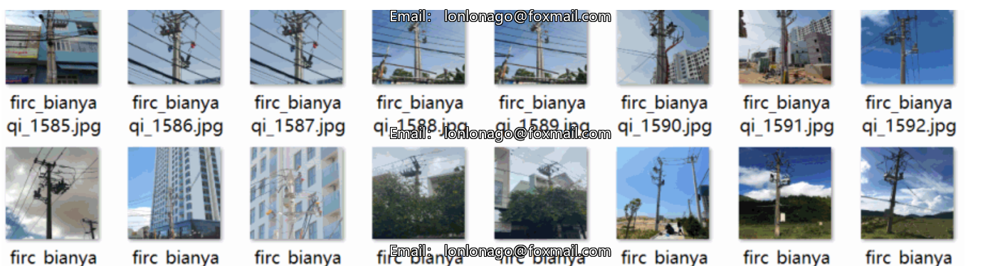

# Power Scene Distribution Transformer Testing Data Set - VOC+YOLO Format - 2994 Images in 1 Class

Size: 281.26MB
Dataset format: Pascal VOC format + YOLO format (excluding split paths in txt files, only containing jpg images along with corresponding VOC format xml files and YOLO format txt files)
Number of images (jpg file count): 2994
Number of annotations (xml file count): 2994
Number of annotations (txt file count): 2994
Number of annotation categories: 1
Annotation category name: ["byq"]
Number of bounding boxes per category: 3121
Total bounding boxes: 3121
Annotation tool used: labelImg
Annotation rules: draw rectangles for each class
Important note: No special statements are made regarding the accuracy or weights of the trained models. The dataset provides accurate and reasonable annotations only.

## Images

Here is a pay link on Stripe ( https://buy.stripe.com/3cs8yP7sY87d0vu9AB ). Please contact me lonlonago@foxmail.com after funding $89, and I will send you a complete data files , thank you!

